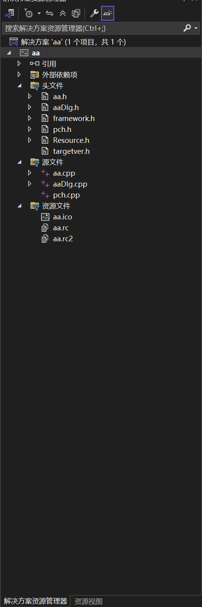
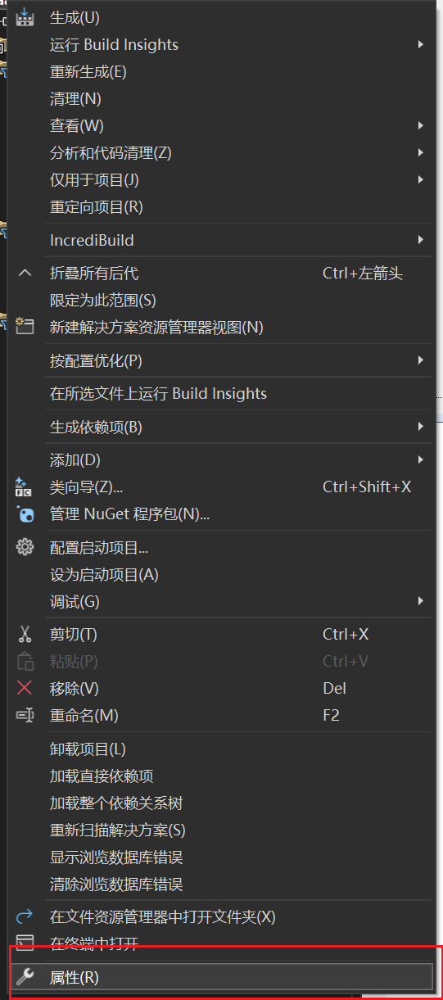
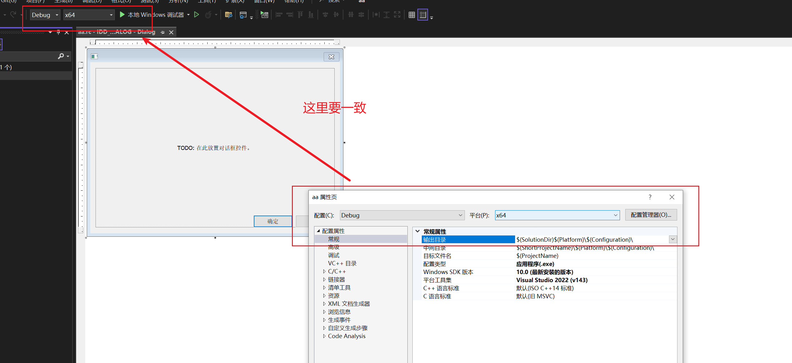
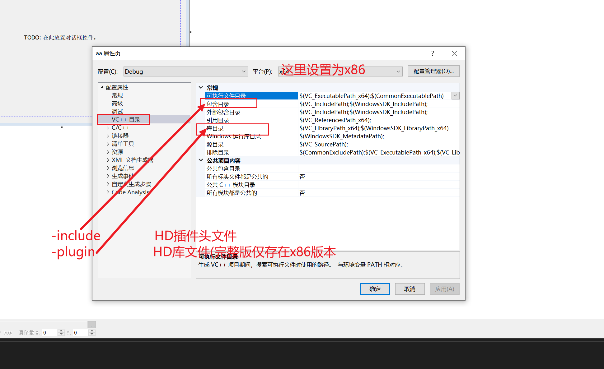
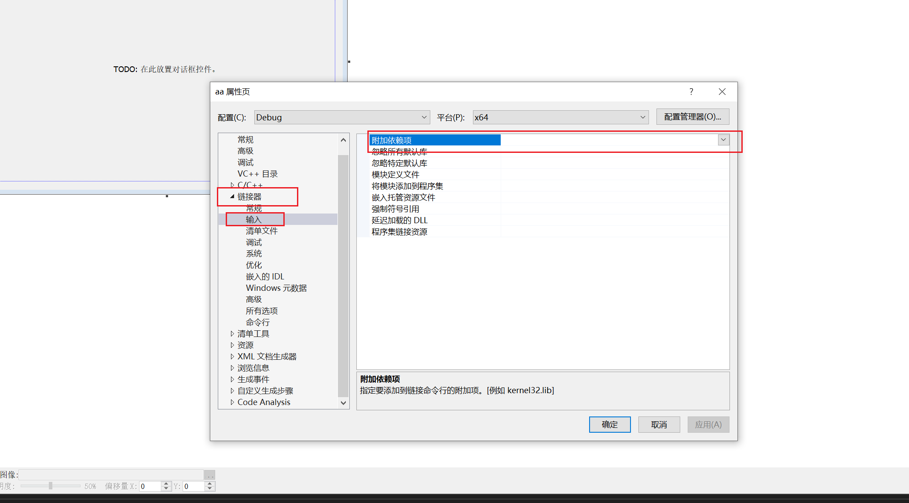

# C/C++ 环境搭建

（具体操作步骤请在b站教程中查看）

1. ## 环境准备

## 群里下载HD平台升级工具 ，使用工具下载完整GDK


下载Visual Studio IDE 或者CLion IDE 确保拥有正确的C/C++开发环境


## 2.使用Visual Studio IDE （vs）搭建开发环境

### 1.新建一个C++项目或者MFC项目

### 2.设置项目属性



在资源管理器右键项目名 点击属性





​	



这里因为使用的是完整版所以选x86 注意插件的版本




### 1.32 debug版本 
#### unicode字符集  为例(注意插件版本)

`uafxcwd.lib;Libcmtd.lib;HDDebug.lib` 

`uafxcwd.lib;Libcmtd.lib;`

#### 2.release版本  unicode字符集

`uafxcw.lib;Libcmt.lib;hd.lib`

`uafxcw.lib;Libcmt.lib;`

以unicode 为例

其它版本请自行查看

## 3.使用 CLion IDE 搭建开发环境
### 1.配置cmake （mingw）
### 以下是一个完整示例
```cmake
cmake_minimum_required(VERSION 3.31)
project(HD_test) 

set(CMAKE_CXX_STANDARD 23)

# 设置输出目录（Debug和Release模式分开）
set(OUTPUT_DIR ${CMAKE_SOURCE_DIR}/bin)
set(CMAKE_RUNTIME_OUTPUT_DIRECTORY_DEBUG ${OUTPUT_DIR}/debug)
set(CMAKE_RUNTIME_OUTPUT_DIRECTORY_RELEASE ${OUTPUT_DIR}/release)

# 创建可执行目标
add_executable(HD_test main.cpp)

# 添加头文件目录
target_include_directories(HD_test PRIVATE
        D:\\HD\\include
)

# 链接库文件（直接区分Debug/Release）
target_link_libraries(HD_test PRIVATE
        # 调试模式链接调试库
        $<$<CONFIG:Debug>:D:\\HD\\HDX64U_Lib\\HDDebug64.lib>
        # 发布模式链接发布库
        $<$<CONFIG:Release>:D:\\HD\\HDX64U_Lib\\hd64.lib>
)

# 自动复制对应模式的DLL到输出目录（关键：解决运行时找不到DLL的问题）
add_custom_command(TARGET HD_test POST_BUILD
        COMMAND ${CMAKE_COMMAND} -E copy_if_different
        # 调试模式DLL路径
        $<$<CONFIG:Debug>:D:\\HD\\HDX64U_Lib\\HDDebug64.dll>
        # 发布模式DLL路径
        $<$<CONFIG:Release>:D:\\HD\\HDX64U_Lib\\hd64.dll>
        # 复制到可执行文件所在目录
        $<TARGET_FILE_DIR:HD_test>
)


```

### 添加部分
```cmake
# 添加头文件目录
target_include_directories(HD_test PRIVATE
        D:\\HD\\include
)
# 链接库文件（直接区分Debug/Release）
target_link_libraries(HD_test PRIVATE
        # 调试模式链接调试库
        $<$<CONFIG:Debug>:D:\\HD\\HDX64U_Lib\\HDDebug64.lib>
        # 发布模式链接发布库
        $<$<CONFIG:Release>:D:\\HD\\HDX64U_Lib\\hd64.lib>
)

# 自动复制对应模式的DLL到输出目录（关键：解决运行时找不到DLL的问题）
add_custom_command(TARGET HD_test POST_BUILD
        COMMAND ${CMAKE_COMMAND} -E copy_if_different
        # 调试模式DLL路径
        $<$<CONFIG:Debug>:D:\\HD\\HDX64U_Lib\\HDDebug64.dll>
        # 发布模式DLL路径
        $<$<CONFIG:Release>:D:\\HD\\HDX64U_Lib\\hd64.dll>
        # 复制到可执行文件所在目录
        $<TARGET_FILE_DIR:HD_test>
)


```
### 可选部分
```cmake
# 设置输出目录（Debug和Release模式分开）
set(OUTPUT_DIR ${CMAKE_SOURCE_DIR}/bin)
set(CMAKE_RUNTIME_OUTPUT_DIRECTORY_DEBUG ${OUTPUT_DIR}/debug)
set(CMAKE_RUNTIME_OUTPUT_DIRECTORY_RELEASE ${OUTPUT_DIR}/release)
```